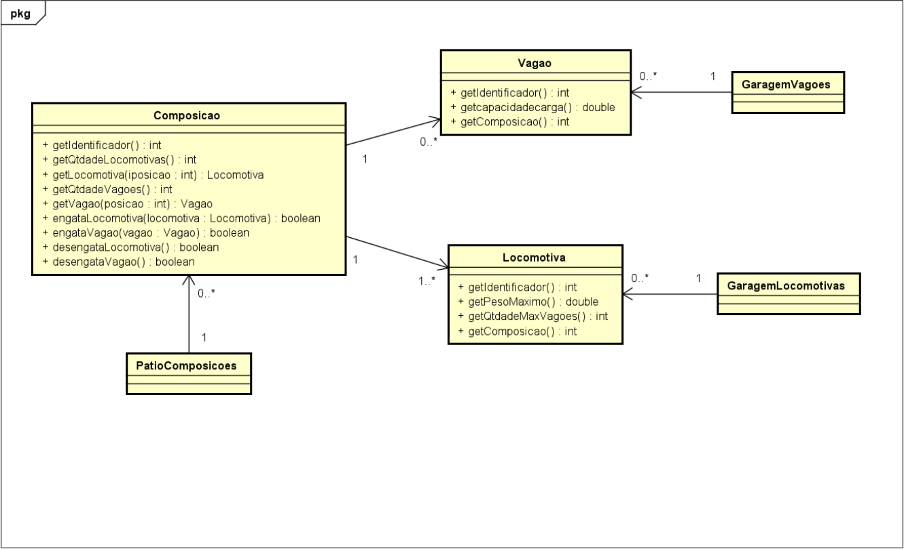

# Train Composition System
## Organizações do trabalho
O seguinte exercício pode ser realizado em grupos de no máximo 3 integrantes. 

Todo o código-fonte do projeto deve ser postado no Moodle. A atividade consiste em realizar o exercício descrito a seguir e entregar todo o código-fonte do projeto em um arquivo zipado.

## Enunciado
Uma empresa ferroviária de transporte de cargas possui um pátio central onde ficam
estacionados os trens que estão em operação.
> TrainGarage.java 

Os vagões e locomotivas livres (que não estão engatados em nenhum trem) ficam estacionados em uma garagem de vagões e em uma garagem de locomotivas, respectivamente.
> WagonGarage.java AND LocomotiveGarage.java

A empresa necessita de um sistema que permita organizar os trens/composições que irão atender as diferentes demandas de carga da empresa.
> Train.java

Um trem é composto por uma ou mais locomotivas e por um ou mais vagões de carga. 
> Locomotive.java AND Wagon.java

Na montagem de um trem as locomotivas e os vagões devem ser selecionados a partir dos que estão estacionados nas garagens. Tanto as locomotivas como os vagões devem ser selecionados na ordem em que serão engatados no trem, respeitando-se as seguintes regras:
- As locomotivas devem ser as primeiras a serem selecionadas. Não é possível “engatar” uma locomotiva após um vagão.
- O total de vagões que podem ser engatados devem respeitar as limitações do conjunto de locomotivas (peso máximo que conseguem puxar e número máximo de vagões que conseguem tracionar). Para o cálculo do peso máximo considerar o peso do vagão com carga máxima.
    > **Observação**: a partir da segunda locomotiva engatada a capacidade total do conjunto de locomotivas deve ser reduzida em 10% a cada nova locomotiva engatada. Exemplo: suponha que todas as locomotivas tenham capacidade para tracionar 50 vagões. Uma composição com uma locomotiva consegue tracionar 50 vagões, com duas locomotivas 90 vagões e com 3 locomotivas 135 vagões.

-  Só é possível engatar uma locomotiva ou vagão por vez e sempre no final do trem. A
locomotiva ou vagão engatados deixam de estar “livres” e não podem ser usados em outro trem.
-  Só é possível desengatar uma locomotiva ou vagão por vez e sempre do final do trem. A locomotiva ou vagão desengatado ficam livres para serem usados em outro trem.

As informações que são mantidas em relação as locomotivas, vagões e composições são as que seguem.

Locomotiva:
- Identificador da locomotiva (int)
- Peso máximo (em toneladas) que consegue puxar (double)
- Número máximo de vagões que consegue tracionar (int)
- Referência da composição que está integrando no momento ou null se está livre

Vagão:
- Identificador do vagão (int)
- Capacidade máxima de carga em toneladas (double)
- Referência da composição que está integrando no momento ou null se está livre

Composição:
- Identificador da composição
- Lista de locomotivas
- Lista de vagões

A figura 1 apresenta o diagrama de classes sugerido para as classes principais do sistema.
Observação: o diagrama não está completo, pois devem ser implementados novos métodos
para atender o enunciado do exercício.

Figura 1 – Diagrama de classes sugerido

## Objetivo
Com base nas informações apresentadas deve ser desenvolvido um sistema em linguagem de programação Java que permita montar e desmontar trens/composições utilizando as locomotivas e vagões pertencentes a empresa (no início do programa deve-se inserir, automaticamente, um conjunto de vagões e locomotivas livres nas garagens).

## Funções do programa
O sistema deve ter opções para:
1. Criar um trem.
    - Esta operação exige que se indique o identificador do trem e a primeira
locomotiva. A primeira locomotiva nunca pode ser removida. Para liberar esta
locomotiva é necessário desfazer o trem.
2. Editar um trem.
    - Inicialmente deve-se indicar o identificador do trem a ser editado. A partir de
então ficam liberadas as seguintes operações:
    - Inserir uma locomotiva (informar identificador) respeitando restrições;
    - Inserir um vagão (informar identificador) respeitando restrições;
    - Remover o último elemento do trem;
    - Listar locomotivas livres;
    - Listar vagões livres;
    - Encerrar a edição do trem.
3. Listar todas os trens já criados (todos os trens que estão no pátio).
4. Desfazer um trem.
    - Deve-se indicar o identificador do trem. A partir de então todos seus vagões e
locomotivas devem ser liberados e o trem excluído da lista de trens.
5. Salvar em um arquivo texto as configurações, organizado como um registro por linha,
os dados de locomotivas, a saber:
    - Identificador da locomotiva (int)
    - Peso máximo (em toneladas) que consegue puxar (double)
    - Número máximo de vagões que consegue tracionar (int)
    - Identificador do trem que estão integrando no momento ou -1 se está livre (int)
6. Carregar as configurações a partir de um arquivo texto
7. Fim.
    - Encerra o programa.

## Configurações 
O programa foi elaborado usando o Visual Studio Code como ambiente de programação e compilação.

Sobre o JAVA:
> OpenJDK version "11.0.20.1" 2023-08-24

> OpenJDK Runtime Environment (build 11.0.20.1+1-post-Ubuntu-0ubuntu122.04)

> OpenJDK 64-Bit Server VM (build 11.0.20.1+1-post-Ubuntu-0ubuntu122.04, mixed mode, sharing)
